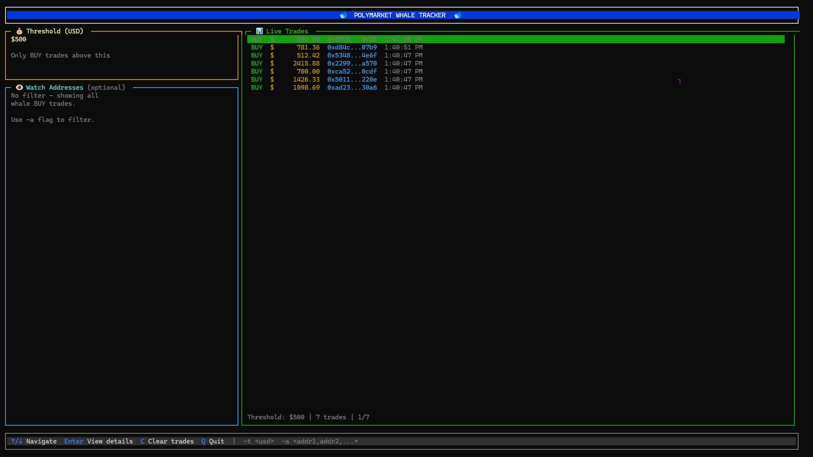

# Polymarket Whale Tracker TUI

A terminal UI that shows large BUY trades on Polymarket in real time.



## What It Does

- Streams Polymarket `OrderFilled` events from HyperSync
- Shows only BUY trades above your threshold
- Optionally filters by buyer/wallet addresses
- Lets you open a selected trade for detailed view

## Requirements

- Bun
- `ENVIO_API_TOKEN` in your environment

## Install

```bash
cd TUI
bun install
```

## Run

On first run, the TUI will prompt you for your HyperSync API key. Enter it and it will be saved to `~/.hypersync/.env` for future runs.

```bash
# First run (interactive - asks for API key)
bun index.ts

# Subsequent runs (uses saved API key)
bun index.ts

# Custom threshold (still prompted for API key)
bun index.ts -t 500

# Threshold + address filter
bun index.ts -t 500 -a "0xabc...,0xdef...,0x123..."
```

You can also pre-set the API key in environment or the config file:

```bash
# Via environment variable
ENVIO_API_TOKEN=your_key_here bun index.ts

# Via config file (manually create ~/.hypersync/.env)
echo "ENVIO_API_TOKEN=your_key_here" > ~/.hypersync/.env
bun index.ts
```

## CLI Flags

- `-t <number>`: USD threshold for BUY trades (default: `100`)
- `-a <addr1,addr2,...>`: Optional comma-separated addresses to filter trades

## Keyboard Controls

- `↑` / `↓` (or `k` / `j`): Move selection
- `Enter`: Open selected trade details
- `T`: Open threshold popup and apply a new USD threshold
- `A` / `a`: Open address popup and apply a new address filter
- `Esc` / `Backspace`: Return from details view
- `C`: Clear current trade list
- `Q` or `Ctrl+C`: Quit

## Notes

- If `-a` is not provided, all BUY trades above threshold are shown.
- Address filter matches buyer/maker/taker fields from decoded trade events.

## Publishing Package

First use the command `bun run build` then `npm publish` command to convert `.ts` file to `.js`.